# プラグイン一覧
## 01
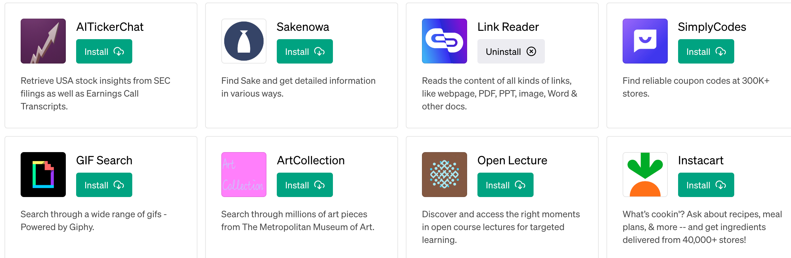
### AITickerChat
SEC提出書類やEarnings Call Transcriptから、米国株に関する洞察を得ることができます。
### Sakenowa
日本酒を探し、様々な方法で詳細な情報を得ることができます。
### Link Reader
ウェブページ、PDF、PPT、画像、Word、その他のドキュメントなど、あらゆる種類のリンクの内容を読み取ることができます。
### SimplyCodes
300K+のストアで信頼性の高いクーポンコードを見つけることができます。
### GIF Search
豊富なgifの中から検索 - Powered by Giphy.
### ArtCollection
メトロポリタン美術館の数百万点の美術品から検索できます。
### Open Lecture
オープンコースの講義で適切な瞬間を発見し、アクセスすることで、的を射た学習ができます。
### Instacart
クッキングって何？レシピ、食事プラン、その他について質問して、40,000以上のお店から食材を届けてもらいましょう！
## 02
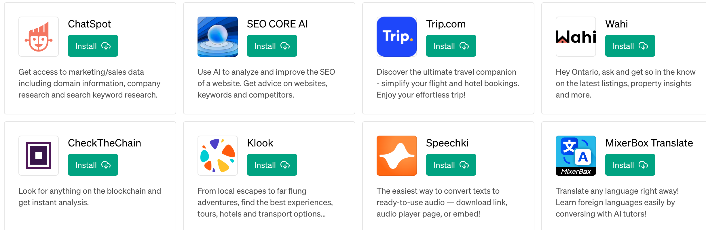
### ChatSpot
ドメイン情報、企業の研究、検索キーワードの研究を含むマーケティング/セールスデータへのアクセスを取得します。
### SEO CORE AI
AIを使用してウェブサイトのSEOを分析し、改善します。ウェブサイト、キーワード、競合についてのアドバイスを得られます。
### Trip.com
最高の旅行パートナーを発見 - フライトとホテルの予約を簡単にします。手間なく旅行を楽しんでください！
Wahi
オンタリオの最新リスト、不動産に関する洞察などについて質問し、その情報を得られます。
### CheckTheChain
ブロックチェーン上の何でもを探し、即時に分析を行います。
### Klook
地元の脱出から遠くの冒険まで、最高の体験、ツアー、ホテル、交通手段を見つけられます。
### Speechki
テキストをすぐに使用可能なオーディオに変換する最も簡単な方法 - ダウンロードリンク、オーディオプレーヤーページ、または埋め込み！
### MixerBox Translate
すぐに任意の言語を翻訳！AIチューターとの会話で外国語を簡単に学びます！
## 03
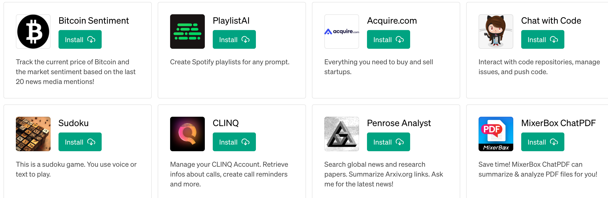
### Bitcoin Sentiment
ビットコインの現在の価格と、最新の20件のニュースメディアの言及に基づく市場のセンチメントを追跡します！
### PlaylistAI
あらゆるプロンプトに対するSpotifyのプレイリストを作成します。
### Acquire.com
スタートアップの購入と販売に必要な全てを提供します。
### Chat with Code
コードリポジトリと対話し、問題を管理し、コードをプッシュします。
### Sudoku
これは数独のゲームです。音声またはテキストを使用してプレイします。
### CLINQ
CLINQ アカウントを管理します。通話に関する情報の取得、通話リマインダーの作成など。
### Penrose Analyst
世界のニュースや研究論文を検索することができます。Arxiv.orgのリンクを要約する。最新のニュースを聞くことができます！
MixerBox ChatPDF
時間を節約しましょう！MixerBox ChatPDF はあなたの代わりに PDF ファイルを要約・解析します！
## 04
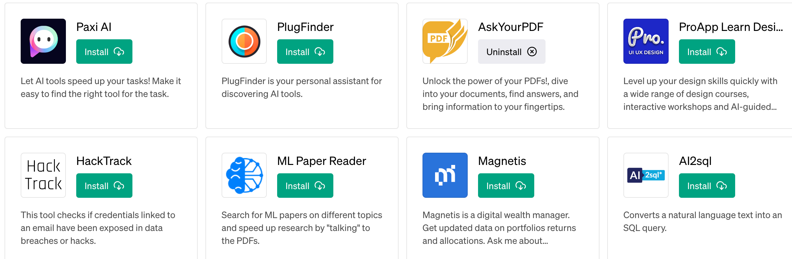
### Paxi AI
AIツールでタスクをスピードアップさせましょう！タスクに適したツールを簡単に見つけることができます。
### PlugFinder
PlugFinderは、AIツールを発見するためのあなたのパーソナルアシスタントです。
### AskYourPDF
あなたのPDFの力を解き放ちましょう！ドキュメントに潜り込み、答えを見つけ、情報をあなたの指先へお届けします。
### ProApp Learn Design
幅広いデザインコース、インタラクティブなワークショップ、AIによる指導で、あなたのデザインスキルを素早くレベルアップさせましょう。
### HackTrack
電子メールにリンクされた認証情報が、データ漏洩やハッキングで公開されていないかどうかをチェックするツールです。
### ML Paper Reader
さまざまなトピックのML論文を検索し、PDFに「話しかける」ことで研究をスピードアップします。
### Magnetis
Magnetisはデジタル・ウェルス・マネージャーです。ポートフォリオのリターンやアロケーションの最新データを入手できます。Magnetisについて聞いてみる。
### AI2sql
自然言語テキストをSQLクエリに変換する。
## 05
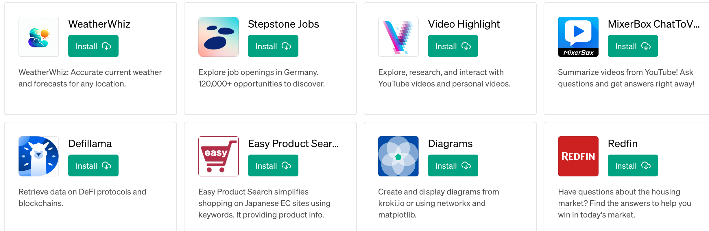
### WeatherWhiz
正確な現在の天気とあらゆる場所の予報を提供します。
### Stepstone Jobs
ドイツの求人情報を検索する。120,000以上の機会を発見することができます。
### Video Highlight
YouTubeのビデオや個人的なビデオを探索し、研究し、交流することができます。
### MixerBox ChatToVideo
YouTubeのビデオを要約する！質問をすると、すぐに答えが返ってきます！
### Defillama
DeFiプロトコルやブロックチェーンに関するデータを取得します。
### Easy Product Search
Easy Product Searchは、日本のECサイトでの買い物をキーワードで簡略化します。商品情報を提供します。
### Diagrams
kroki.ioやnetworkx、matplotlibを使って図を作成・表示できます。
### Redfin
住宅市場について質問がありますか？今日の市場で勝つための答えを見つけてください。
## 06
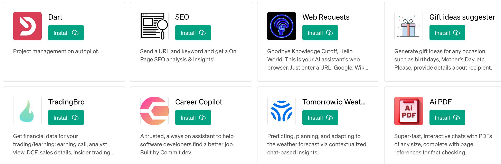
### Dart
自動制御でプロジェクト管理。
### SEO
URLとキーワードを送信すると、On Page SEOの分析とインサイトを得ることができます
### Web Requests
さよならナレッジカットオフ、ハローワールド！これはあなたのAIアシスタントのウェブブラウザです。URLを入力するだけ。Google、Wiki、GitHub。
### Gift ideas suggester
誕生日、母の日など、あらゆる機会にギフトのアイデアを生成します。贈る相手の詳細を入力してください。
### TradingBro
トレーディングや学習のための財務データを入手できます：イヤーコール、アナリストの見解、DCF、販売詳細、インサイダー取引など。
### Career Copilot
ソフトウェア開発者がより良い仕事を見つけるのを助ける、信頼できる常時稼働のアシスタントです。Commit.devによって構築されています。
### Tomorrow.io Weather
天気予報を予測、計画、適応させるために、チャットベースの文脈に沿った洞察を提供します。
### Ai PDF
どんなサイズのPDFでも、超高速でインタラクティブなチャットができ、事実確認のためのページ参照も可能です。
## 07
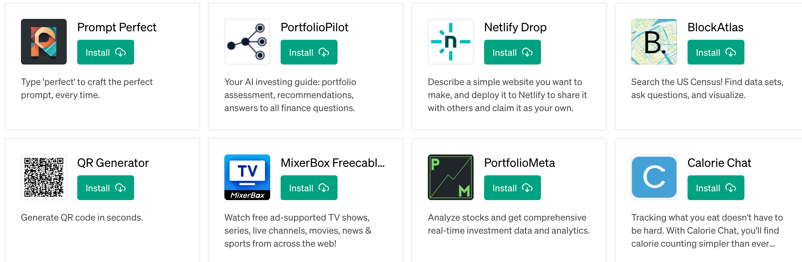
### Prompt Perfect
「perfect」と入力すると、毎回完璧なプロンプトが作成されます。
### PortfolioPilot
あなたのAI投資ガイド：ポートフォリオの評価、推奨、あらゆるファイナンスの質問への回答。
### Netlify Drop
作りたい簡単なウェブサイトを記述し、それをNetlifyにデプロイして他の人と共有し、自分のものとして主張します。
### BlockAtlas
米国国勢調査を検索することができます！データセットを検索し、質問し、視覚化することができます。
### QR Generator
QR コードを数秒で生成します。
### MixerBox FreecableTV
無料の広告付きテレビ番組、シリーズ、ライブチャンネル、映画、ニュース、スポーツをウェブ全体から見ることができます！
### PortfolioMeta
銘柄を分析し、包括的なリアルタイムの投資データと分析を得ることができます。
### Calorie Chat
食べたものを記録するのは、難しいことではありません。カロリーチャットを使えば、カロリー計算がこれまで以上に簡単になります。
## 08
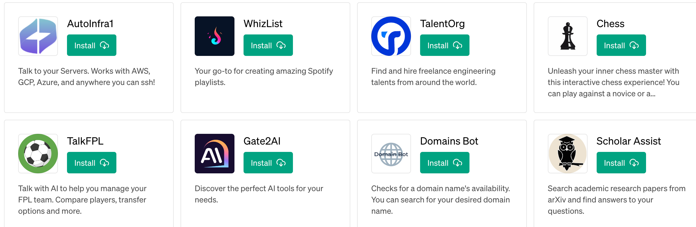
### AutoInfra1
サーバーに話しかけよう。AWS、GCP、Azure、そしてsshが使える場所であればどこでも使えます！
### WhizList
Spotifyの素晴らしいプレイリストを作成するのに便利です。
### TalentOrg
世界中のフリーランスのエンジニアの才能を見つけ、雇うことができます。
### Chess
このインタラクティブなチェス体験で、あなたの中のチェスマスターを解き放ちましょう！初心者やグランドマスターと対戦することができます！
### TalkFPL
AIと会話して、FPLチームの運営をサポートします。選手の比較や移籍のオプションなど、様々な情報を得ることができます。
### Gate2AI
あなたのニーズにぴったりのAIツールを発見してください。
### Domains Bot
ドメイン名が利用可能かどうかをチェックします。希望のドメイン名を検索することができます。
### Scholar Assist
arXivの学術研究論文を検索し、質問の答えを見つけることができます。
## 09
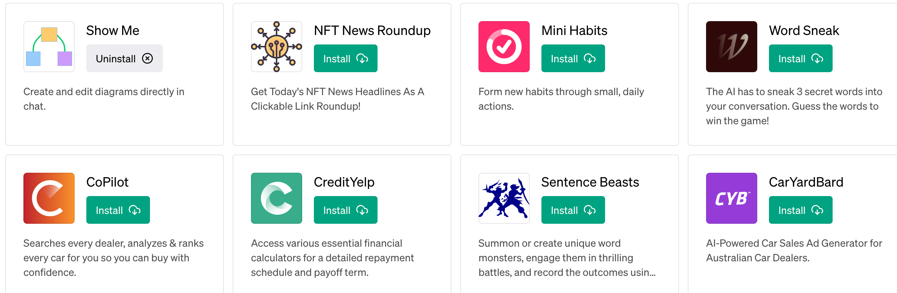
### Show Me
チャットで直接ダイアグラムを作成・編集できます。
### NFT News Roundup
今日のNFTニュースヘッドラインをクリック可能なリンクとして取得するラウンドアップ！
### Mini Habits
毎日の小さな行動で新しい習慣を身につけましょう。
### Word Sneak
AIがあなたの会話に3つの秘密の単語を忍び込ませます。ゲームに勝つために単語を推測してください！
### CoPilot
すべてのディーラーを検索し、あなたのためにすべての車を分析し、ランク付けして、安心して購入できるようにします。
### CreditYelp
詳細な返済スケジュールや返済期間など、様々な必須金融計算機にアクセスできます。
### Sentence Beasts
ユニークな単語モンスターを召喚または作成し、スリリングなバトルを繰り広げ、その結果をWord Monstersで記録します。
### CarYardBard
オーストラリアの自動車ディーラー向けにAIを搭載した自動車販売広告ジェネレーターです。
## 10
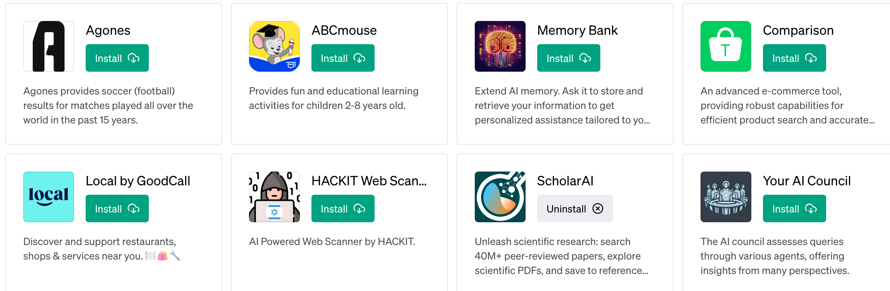
### Agones
Agonesは、過去15年間に世界中で行われたサッカー（フットボール）の試合結果を提供します。
### ABCmouse
2～8歳の子供向けに、楽しくて教育的な学習アクティビティを提供。
### Memory Bank
AIの記憶を拡張します。AIに自分の情報を保存・検索してもらうことで、ニーズに合わせたパーソナライズされた支援を受けることができます。
### Comparison
先進的なEコマースツールで、効率的な製品検索と正確な価格比較のための強力な機能を提供します。
### Local by GoodCall
あなたの近くのレストラン、ショップ、サービスを発見し、サポートします。🍽️ 🛍️ 🔧
### HACKIT Web Scanner
HACKITによるAI搭載のウェブスキャナーです。
### ScholarAI
科学研究を解き放つ：40M+の査読付き論文を検索し、科学的なPDFを探索し、参照マネージャに保存します。
### Your AI Council
AIカウンシルは、様々なエージェントを通じてクエリを評価し、多角的な視点から洞察を提供します。
## 11
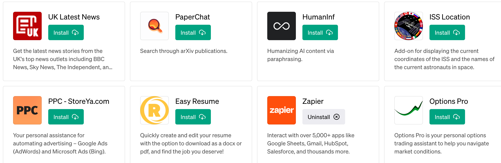
### UK Latest News
BBC News、Sky News、The Independentなど、英国のトップニュースから最新のニュース記事を入手できます。
### PaperChat
arXiv の出版物を検索することができます。
### HumanInf
AIコンテンツをパラフレーズによって人間らしくする。
### ISS Location
ISSの現在の座標と、現在宇宙にいる宇宙飛行士の名前を表示するためのアドオン。
### PPC - StoreYa.com
Google Ads (AdWords) と Microsoft Ads (Bing) の広告を自動化するためのパーソナルアシスタントです。
### Easy Resume
履歴書を素早く作成・編集し、docxやpdfでダウンロードできるオプションもあり、自分に合った仕事を見つけることができます！
### Zapier
Google Sheets、Gmail、HubSpot、Salesforceなど、5,000以上のアプリと連動できます。
### Options Pro
オプション・プロは、あなたの個人的なオプション取引アシスタントで、市場環境をナビゲートします。
## 12
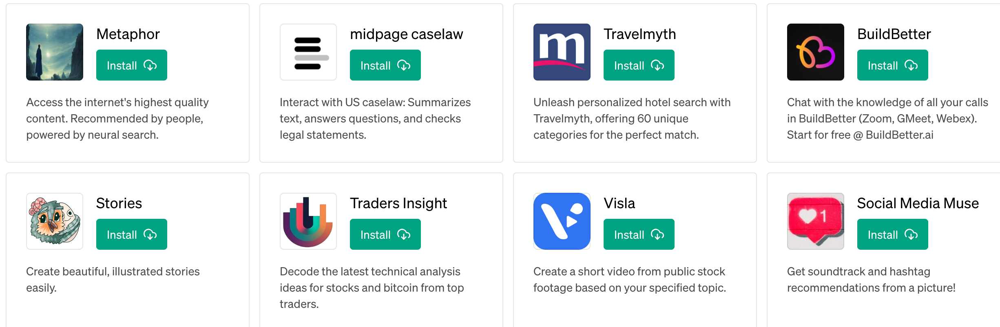
### Metaphor
インターネット上の最高品質のコンテンツにアクセスできます。ニューラル・サーチを駆使し、人々に推奨されています。
### midpage caselaw
米国の判例と対話する： 文章を要約し、質問に答え、法的記述をチェックします。
### Travelmyth
60のユニークなカテゴリーを提供し、完璧なマッチングを実現するTravelmythでパーソナライズされたホテル検索を解き放ちます。
### BuildBetter
BuildBetter (Zoom、GMeet、Webex) ですべてのコールの知識とチャットします。無料で始める@ BuildBetter.ai
### Stories
美しいイラスト付きのストーリーを簡単に作成できます。
### Traders Insight
トップトレーダーによる株式やビットコインの最新のテクニカル分析のアイデアを解読します。
### Visla
指定したトピックに基づき、公開されているストック映像から短いビデオを作成します。
### Social Media Muse
写真からサウンドトラックやハッシュタグの推奨を得ることができます！
## 13
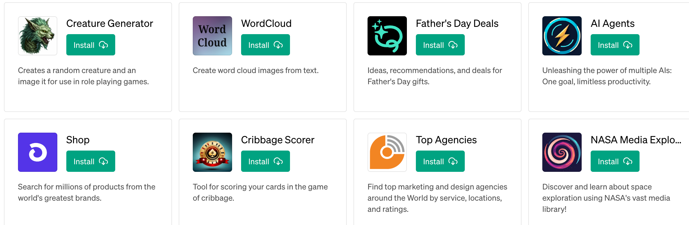
### Creature Generator
ロールプレイングゲームで使用するために、ランダムなクリーチャーとその画像を作成します。
### WordCloud
テキストからワードクラウドイメージを作成します。
### Father's Day Deals
父の日のプレゼントのアイデア、おすすめ、お得な情報を紹介します。
### AI Agents
複数のAIが持つパワーを解き放つ： 1つの目標で、無限の生産性を実現します。
### Shop
世界の有名ブランドが提供する数百万点の製品を検索できます。
### Cribbage Scorer
クリベッジゲームでカードに点数をつけるためのツールです。
### Top Agencies
世界中のマーケティングやデザインのトップエージェンシーを、サービス、場所、評価で検索できます。
### NASA Media Explorer
NASA の膨大なメディアライブラリを使用して、宇宙探査について発見し、学ぶことができます！
## 14
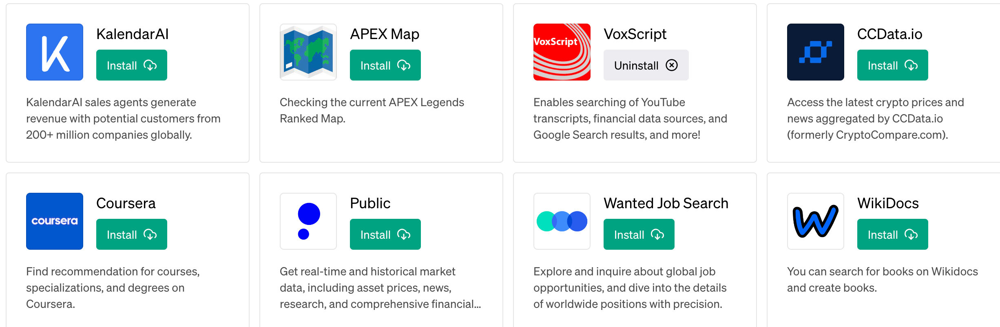
### KalendarAI
KalendarAIの販売代理店は、世界2億社以上の潜在顧客から収益を得ることができます。
### APEX Map
現在のAPEX Legends Ranked Mapを確認する。
### VoxScript
YouTubeのトランスクリプト、金融データソース、Google検索結果などの検索を可能にする！
### CCData.io
CCData.io (旧 CryptoCompare.com) によって集約された最新の暗号価格とニュースにアクセスできます。
### Coursera
Courseraのコース、専門分野、学位の推薦を見つけることができます。
### Public
資産価格、ニュース、リサーチ、包括的な財務分析など、リアルタイムおよび過去の市場データを入手できます。
### Wanted Job Search
グローバルな求人情報を調査・照会し、世界中のポジションの詳細に正確に飛び込むことができます。
### WikiDocs
Wikidocsで書籍を検索したり、書籍を作成したりすることができます。
## 15
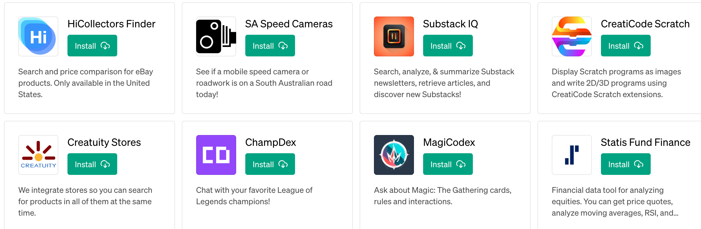
### HiCollectors Finder
eBay商品の検索と価格比較ができます。米国でのみ利用可能です。
### SA Speed Cameras
南オーストラリアの道路に移動式スピードカメラや道路工事が今日行われているかどうかを確認することができます！
### Substack IQ
Substackのニュースレターを検索、分析、要約し、記事を取得し、新しいSubstackを発見することができます！
### CreatiCode Scratch
Scratchのプログラムを画像として表示したり、CreatiCode Scratchの拡張機能を使用して2D/3Dプログラムを書き込むことができます。
### Creatuity Stores
店舗を統合し、すべての店舗で同時に商品検索ができるようにしました。
### ChampDex
お気に入りのLeague of Legendsのチャンピオンとチャットできます！
### MagiCodex
マジック：ザ・ギャザリングのカード、ルール、インタラクションについて質問できます。
### Statis Fund Finance
株式を分析するための金融データツールです。価格相場の取得、移動平均線、RSIの分析が可能です。
## 16
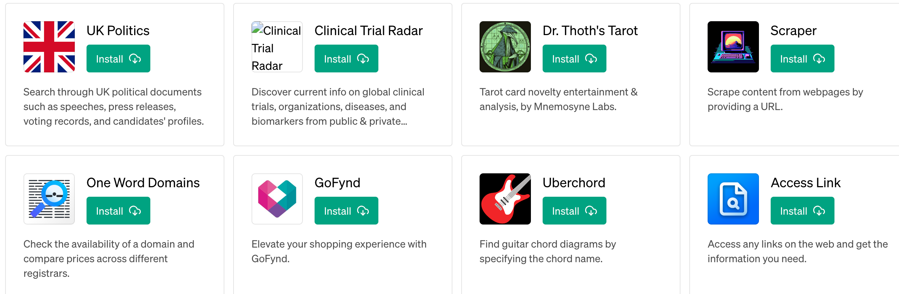
### UK Politics
演説、プレスリリース、投票記録、候補者のプロフィールなど、イギリスの政治資料を検索することができます。
### Clinical Trial Radar
公的・私的研究によるグローバルな臨床試験、組織、疾患、バイオマーカーに関する最新情報を発見することができます。
### Dr. Thoth's Tarot
Mnemosyne Labsによるタロットカードの斬新なエンターテイメントと分析。
### Scraper
URL を指定してウェブページからコンテンツをスクレイピングします。
### One Word Domains
ドメインの空き状況を確認し、さまざまなレジストラで価格を比較することができます。
### GoFynd
GoFyndでショッピング体験を向上させましょう。
### Uberchord
コードネームを指定して、ギターのコードダイアグラムを検索します。
### Access Link
ウェブ上のあらゆるリンクにアクセスし、必要な情報を得ることができます。
## 17
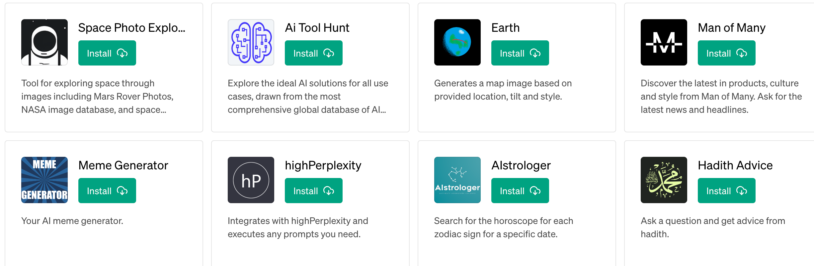
### Space Photo Explorer
マーズローバーの写真、NASAの画像データベース、今日の宇宙写真など、画像を通して宇宙を探索するツール。
### Ai Tool Hunt
AIツールの最も包括的なグローバルデータベースから抽出された、あらゆるユースケースに対応する理想的なAIソリューションを探索します。
### Earth
提供された位置、傾き、スタイルに基づいて、地図画像を生成します。
### Man of Many
Man of Manyの製品、カルチャー、スタイルの最新情報をお届けします。最新のニュースやヘッドラインを聞くことができます。
### Meme Generator
あなたのAIミームジェネレーターです。
### highPerplexity
highPerplexityと統合され、必要なプロンプトを実行することができます。
### AIstrologer
特定の日付の各星座のホロスコープを検索します。
### Hadith Advice
質問をすると、ハディースからアドバイスを得ることができます。
## 18
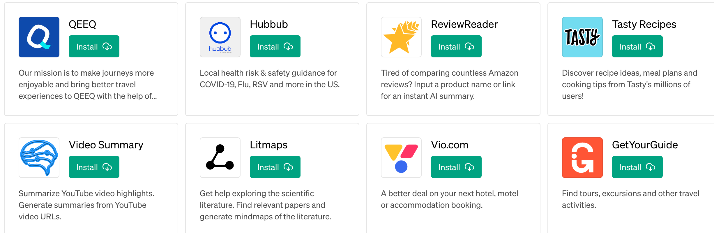
### QEEQ
私たちのミッションは、テクノロジーの力を借りて、旅をより楽しくし、より良い旅行体験をQEEQにもたらすことです。
### Hubbub
米国におけるCOVID-19、インフルエンザ、RSVなどの地域の健康リスク＆安全ガイダンスです。
### ReviewReader
数え切れないほどのAmazonレビューを比較するのはもううんざり？製品名やリンクを入力すると、AIが即座に概要を表示します。
### Tasty Recipes
Tastyの数百万人のユーザーからレシピのアイデア、食事計画、料理のヒントを発見してください！
### Video Summary
YouTube動画のハイライトを要約します。YouTubeの動画URLから要約を生成します。
### Litmaps
科学文献の探索をサポートします。関連する論文を検索し、文献のマインドマップを生成します。
### Vio.com
次のホテル、モーテル、宿泊施設の予約をよりお得に。
### GetYourGuide
ツアー、エクスカーション、その他の旅行アクティビティを検索できます。
## 19
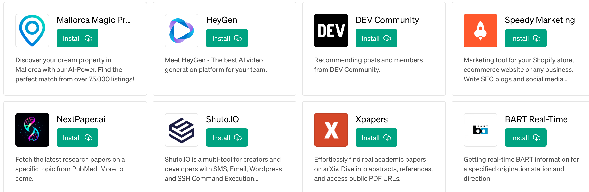
### Mallorca Magic Property Search
AI-POWERでマヨルカの夢の物件を見つけましょう。75,000件以上の物件から最適な物件を探しましょう！
### HeyGen
HeyGenの紹介 - あなたのチームに最適なAIビデオ生成プラットフォームです。
### DEV Community
DEV Communityから投稿やメンバーを推薦します。
### Speedy Marketing
Shopifyストア、eコマースサイト、またはあらゆるビジネスのためのマーケティングツールです。SEOブログとソーシャルメディアコンテンツを書く。
### NextPaper.ai
PubMedから特定のトピックに関する最新の研究論文を取得します。今後さらに増える予定です。
### Shuto.IO
Shuto.IOは、SMS、メール、Wordpress、SSHコマンド実行機能を備えたクリエイターやデベロッパーのためのマルチツールです。
### Xpapers
arXivに掲載されている本物の学術論文を簡単に見つけることができます。抄録、参考文献、公開PDF URLにアクセスできます。
### BART Real-Time
指定した発着駅と方角の BART 情報をリアルタイムで取得します。
## 20
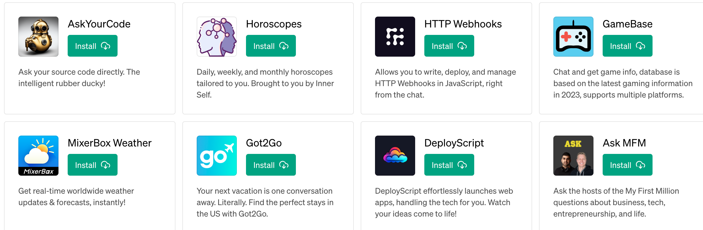
### AskYourCode
ソースコードに直接質問することができます。知的なラバーダッキー！
### Horoscopes
毎日、毎週、毎月、あなたに合わせたホロスコープをお届けします。インナーセルフがお届けします。
### HTTP Webhooks
チャットからJavaScriptでHTTP Webhookを作成、デプロイ、管理できるようになります。
### GameBase
チャットでゲーム情報を取得。データベースは2023年の最新ゲーム情報に基づいており、複数のプラットフォームをサポートしています。
### MixerBox Weather
世界中の天気予報をリアルタイムで取得できます！
### Got2Go
次のバケーションは、会話1つで決まります。文字どおり。Got2Go でアメリカの完璧な滞在先を見つけましょう。
### DeployScript
DeployScript は、ウェブアプリケーションを簡単に起動し、技術的な処理を代行します。あなたのアイディアに命を吹き込みましょう！
### Ask MFM
My First Millionのホストに、ビジネス、テクノロジー、起業、人生について質問してみましょう。
## 21
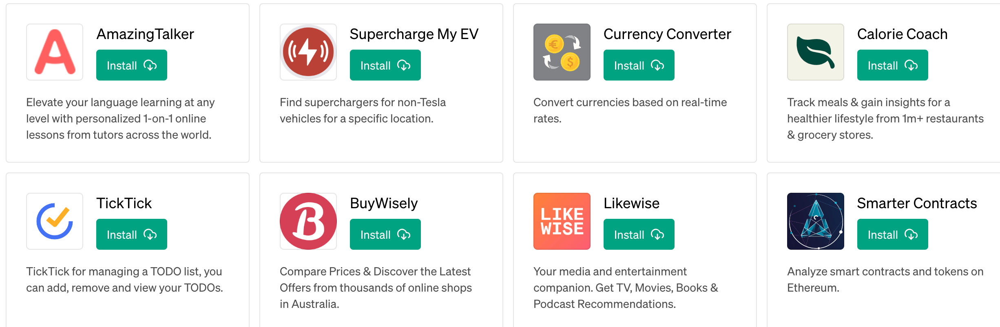
### AmazingTalker
世界中の講師から1対1のオンラインレッスンが受けられるので、どんなレベルでも語学学習を向上させることができます。
### Supercharge My EV
特定の場所のテスラ車以外のスーパーチャージャーを検索します。
### Currency Converter
リアルタイムのレートに基づいて通貨を変換します。
### Calorie Coach
1m 以上のレストランや食料品店から、より健康的なライフスタイルのための食事を追跡し、洞察を得ることができます。
### TickTick
TODOリストを管理するTickTickは、TODOを追加、削除、表示することができます。
### BuyWisely
オーストラリアの数千のオンラインショップの価格を比較し、最新のオファーを発見することができます。
### Likewise
あなたのメディアとエンターテイメントのパートナーです。テレビ、映画、本、ポッドキャストのおすすめを入手できます。
### Smarter Contracts
イーサリアム上のスマートコントラクトとトークンを分析します。
## 22
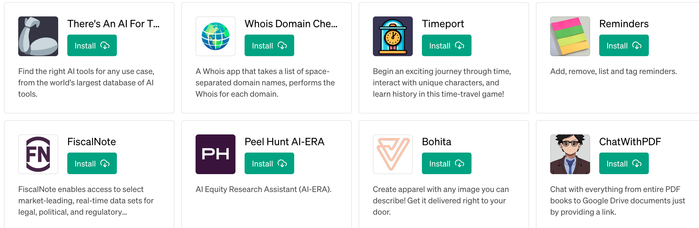
### There's An AI For That
世界最大のAIツールのデータベースから、あらゆるユースケースに対応する適切なAIツールを見つけることができます。
### Whois Domain Checker
スペースで区切られたドメイン名のリストを受け取り、各ドメインのWhoisを実行するWhoisアプリです。
### Timeport
このタイムトラベルゲームで、時間を超えたエキサイティングな旅を始め、ユニークなキャラクターと交流し、歴史を学ぶことができます！
### Reminders
リマインダーの追加、削除、リスト、タグ付けができます。
### FiscalNote
FiscalNoteは、法律、政治、規制情報のための、市場をリードするリアルタイムのデータセットにアクセスすることができます。
### Peel Hunt AI-ERA
AIエクイティリサーチアシスタント（AI-ERA）。
### Bohita
描写できるあらゆるイメージでアパレルを作成！あなたの家のドアまでお届けします。
### ChatWithPDF
リンクを貼るだけで、PDFブック全体からGoogle Driveドキュメントまで、あらゆるものとチャットできます。
## 23
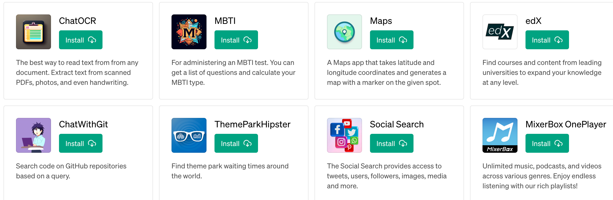
### ChatOCR
あらゆる文書からテキストを読み取る最良の方法です。スキャンした PDF、写真、そして手書き文字からテキストを抽出します。
### MBTI
MBTI テストを実施するためのものです。質問リストを取得し、MBTIタイプを計算することができます。
### Maps
緯度経度の座標を取得し、指定された場所にマーカーを付けた地図を生成するMapsアプリです。
### edX
あらゆるレベルの知識を広げるために、一流大学のコースやコンテンツを探すことができます。
### ChatWithGit
クエリに基づいて GitHub リポジトリのコードを検索します。
### ThemeParkHipster
世界中のテーマパークの待ち時間を検索できます。
### Social Search
ソーシャルサーチでは、ツイート、ユーザー、フォロワー、画像、メディアなどへアクセスできます。
### MixerBox OnePlayer
様々なジャンルの音楽、ポッドキャスト、ビデオが無制限に楽しめます。豊富なプレイリストで無限のリスニングをお楽しみください！
## 24
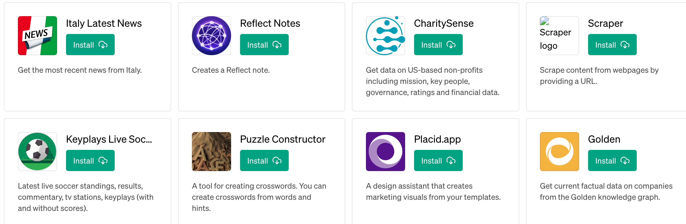
### Italy Latest News
イタリアからの最新ニュースをお届けします。
### Reflect Notes
Reflectノートを作成します。
### CharitySense
ミッション、キーパーソン、ガバナンス、格付け、財務データなど、米国に拠点を置く非営利団体に関するデータを入手できます。
### Scraper
URL を指定して Web ページからコンテンツをスクレイピングします。
### Keyplays Live Soccer
最新のサッカー中継、結果、解説、テレビ局、キープレー（スコアあり、スコアなし）。
### Puzzle Constructor
クロスワードを作成するためのツールです。単語やヒントからクロスワードを作成することができます。
### Placid.app
テンプレートからマーケティングビジュアルを作成するデザインアシスタントです。
### Golden
Goldenのナレッジグラフから、企業の現在の事実データを取得します。
## 25
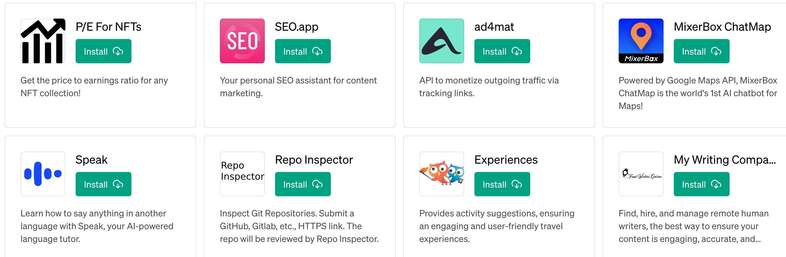
### P/E For NFTs
任意の NFT コレクションの株価収益率を取得します！
### SEO.app
コンテンツマーケティングのための個人的なSEOアシスタントです。
### ad4mat
トラッキングリンク経由で発信トラフィックを収益化するためのAPIです。
### MixerBox ChatMap
Google Maps APIを搭載したMixerBox ChatMapは、世界初のマップ用AIチャットボットです！
### Speak
AIを搭載した言語チューター、Speakで他の言語での言い方を学びましょう。
### Repo Inspector
Git Repositoriesを検査します。GitHub、Gitlab などの HTTPS リンクを送信してください。レポインスペクターでレポを確認します。
### Experiences
アクティビティーの提案を行い、魅力的でユーザーフレンドリーな旅行体験を保証します。
### My Writing Companion
リモートで働く人間のライターを検索、雇用、管理し、コンテンツが魅力的で正確であることを保証する最良の方法です。
## 26
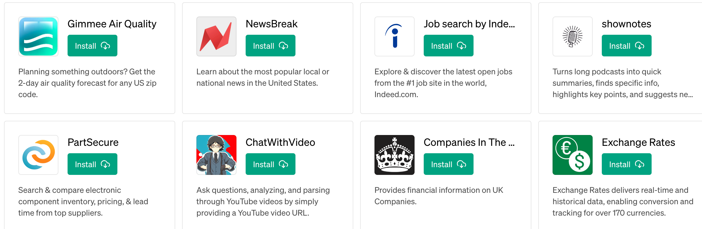
### Gimmee Air Quality
アウトドアを計画中ですか？アメリカの郵便番号の2日間の大気質予報を入手できます。
### NewsBreak
米国で最も人気のあるローカルまたはナショナルニュースについて学びましょう。
### Job search by Indeed
世界No.1の求人サイトIndeed.comの最新の求人情報を検索・発見することができます。
### shownotes
長いポッドキャストを素早く要約し、特定の情報を見つけ、重要なポイントを強調し、新しいエピソードを提案します。
### PartSecure
トップサプライヤーからの電子部品の在庫、価格、リードタイムを検索・比較できます。
### ChatWithVideo
YouTubeビデオのURLを指定するだけで、YouTubeビデオの質問、分析、解析ができます。
### Companies In The UK
イギリスの企業に関する財務情報を提供します。
### Exchange Rates
為替レートは、リアルタイムとヒストリカルデータを提供し、170以上の通貨の変換とトラッキングを可能にします。
## 27
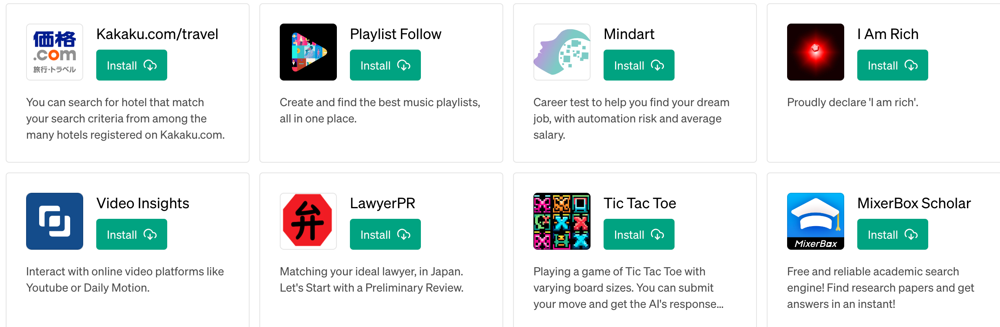
### 価格.com/travel
価格.comに登録されている多くのホテルの中から、検索条件に合うホテルを検索することができます。
### Playlist Follow
最高の音楽プレイリストを作成し、見つけることができます。
### Mindart
理想の仕事を見つけるためのキャリアテスト。自動化リスクや平均給与も表示されます。
### I Am Rich
「私はお金持ちです」と誇らしげに宣言しましょう。
### Video Insights
YoutubeやDaily Motionのようなオンラインビデオプラットフォームと交流することができます。
### LawyerPR
あなたの理想の弁護士を日本でマッチングします。まずは予習から始めましょう。
### Tic Tac Toe
ボードの大きさを変えながら、チックタックトーのゲームをプレイする。自分の手を提出し、AIの応答手を得ることができます。
### MixerBox Scholar
無料かつ信頼性の高い学術検索エンジン！研究論文を見つけ、瞬時に答えを得ることができます！
## 28
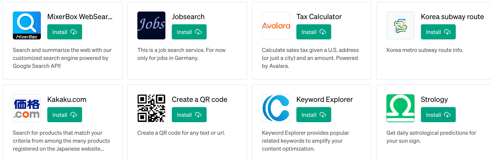
### MixerBox WebSearchG
Google Search API を利用してカスタマイズされた検索エンジンで、ウェブを検索して要約します！
### Jobsearch
これは仕事検索サービスです。今のところドイツ国内の求人情報のみです。
### Tax Calculator
米国の住所（または都市名）と金額を指定して、消費税を計算します。Powered by Avalara.
### Korea subway route
韓国の地下鉄の路線情報。
### 価格.com
日本のサイト「価格.com」に登録されている多くの商品の中から、条件に合う商品を検索します。
### Create a QR code
任意のテキストやURLのQRコードを作成することができます。
### Keyword Explorer
キーワードエクスプローラーは、コンテンツの最適化を促進するために、人気のある関連キーワードを提供します。
### Strology
あなたの太陽星座の毎日の占星術の予測を取得します。
## 29
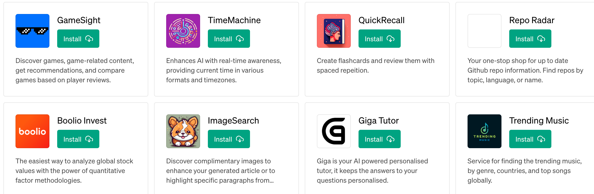
### GameSight
ゲームやゲーム関連コンテンツの発見、おすすめ情報の入手、プレイヤーのレビューに基づくゲームの比較などができます。
### TimeMachine
リアルタイムな認識でAIを強化し、さまざまな形式やタイムゾーンで現在の時刻を提供します。
### QuickRecall
フラッシュカードを作成し、スペーシングリピートで復習することができます。
### Repo Radar
最新の Github リポ情報をワンストップで提供します。トピック、言語、名前からレポを検索できます。
### Boolio Invest
定量的なファクター手法の力を借りて、世界の株式価値を分析する最も簡単な方法です。
### ImageSearch
生成された記事を強化したり、特定の段落を強調したりするための補完的な画像をUnsplashから発見します。
### Giga Tutor
Gigaは、AIを搭載したパーソナルな家庭教師で、あなたの質問に対する答えをパーソナルなものにします。
### Trending Music
ジャンル別、国別、世界のトップソングなど、トレンドの音楽を見つけるためのサービスです。
## 30
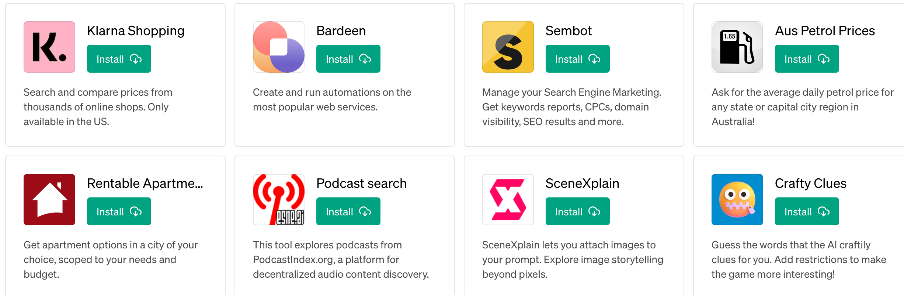
### GameSight
ゲームやゲーム関連コンテンツの発見、おすすめ情報の入手、プレイヤーのレビューに基づくゲームの比較など。
### TimeMachine
様々なフォーマットやタイムゾーンで現在時刻を提供し、リアルタイムな認識でAIを強化します。
### QuickRecall
フラッシュカードを作成し、スペーシングリピートで復習することができます。
### Repo Radar
最新の Github リポ情報をワンストップで提供します。トピック、言語、名前からレポを検索できます。
### Boolio Invest
定量的なファクター手法の力を借りて、世界の株式価値を分析する最も簡単な方法です。
### ImageSearch
生成された記事を強化したり、特定の段落を強調するための補完的な画像をUnsplashから発見します。
### Giga Tutor
Gigaは、AIを搭載したパーソナルな家庭教師で、あなたの質問に対する答えをパーソナルなものにします。
### Trending Music
ジャンル別、国別、世界のトップソングなど、トレンドの音楽を見つけることができるサービスです。
## 31
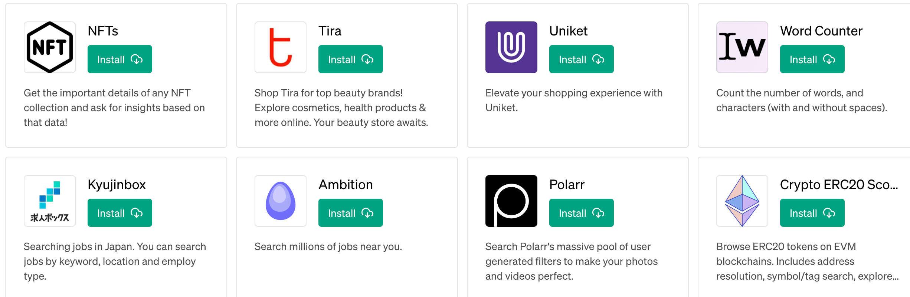
### NFTs
NFTコレクションの重要な詳細を入手し、そのデータに基づく洞察を求めることができます！
### Tira
トップビューティブランドのショップTira！化粧品、健康食品、その他をオンラインで検索できます。あなたのビューティーショップが待っています。
### Uniket
Uniketでショッピングをもっと楽しく。
### Word Counter
単語数、文字数（スペースあり、スペースなし）をカウントします。
### 求人box
日本国内の求人情報を検索することができます。キーワード、勤務地、雇用形態から仕事を検索できます。
### Ambition
あなたの近くの数百万件の仕事を検索します。
### Polarr
Polarrの膨大な数のユーザー生成フィルターを検索して、写真やビデオを完璧に仕上げることができます。
### Crypto ERC20 Scout
EVM ブロックチェーン上の ERC20 トークンを閲覧できます。アドレス解決、シンボル/タグ検索、エクスプローラーを含みます。
## 32
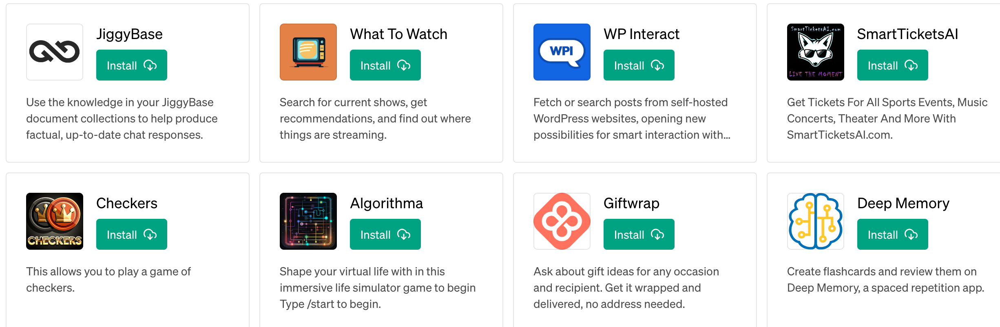
### JiggyBase
JiggyBaseのドキュメント・コレクションにある知識を利用して、事実に基づいた最新のチャット・レスポンスを作成することができます。
### What To Watch
現在放送中の番組を検索したり、おすすめの番組を入手したり、どこで配信されているかを調べたりすることができます。
### WP Interact
セルフホスティングされた WordPress ウェブサイトから投稿を取得または検索し、コンテンツとのスマートな対話の新しい可能性を開きます。
### SmartTicketsAI
SmartTicketsAI.comでスポーツイベント、音楽コンサート、演劇などのチケットを手に入れましょう。
### Checkers
これにより、チェッカーゲームをプレイすることができます。
### Algorithma
この没入型ライフシミュレーターゲームで、あなたのバーチャルライフを形作りましょう。
### Giftwrap
どんな場面でも、どんな相手でも、ギフトのアイデアについて聞いてみましょう。住所不要でラッピングしてお届けします。
### Deep Memory
フラッシュカードを作成し、間隔を空けて繰り返すアプリ、Deep Memoryで復習しましょう。
## 33
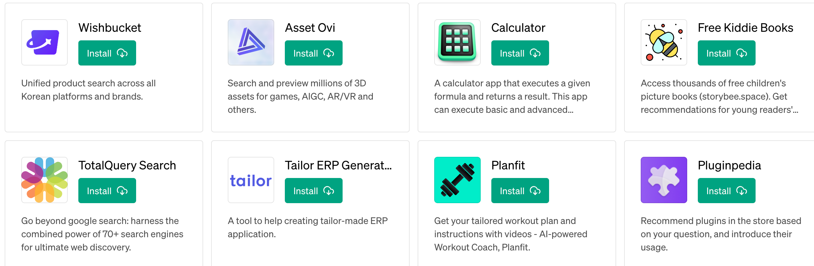
### Wishbucket
韓国のすべてのプラットフォームとブランドで統一された商品検索が可能です。
### Asset Ovi
ゲーム、AIGC、AR/VRなどのための数百万もの3Dアセットを検索してプレビューできます。
### Calculator
与えられた計算式を実行し、結果を返す電卓アプリです。基本的な演算から高度な演算まで実行できるアプリです。
### Free Kiddie Books
何千冊もの無料の子供向け絵本にアクセスできます（storybee.space）。若い読者の興味に合わせたおすすめを入手できます。
### TotalQuery Search
Google 検索を超える：70 以上の検索エンジンの総合力を活用し、究極のウェブ発見を実現します。
### Tailor ERP Generator
オーダーメイドの ERP アプリケーションの作成を支援するツールです。
### Planfit
オーダーメイドのワークアウトプランとビデオによる指導を受ける - AI搭載のワークアウトコーチ、Planfit。
### Pluginpedia
質問に応じてストア内のプラグインをレコメンドし、その使い方を紹介する。
## 34
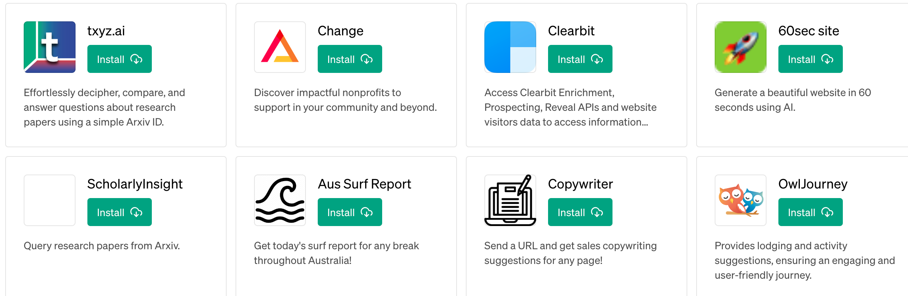
### txyz.ai
ArxivのIDだけで研究論文の解読・比較・回答が楽々できる。
### Change
あなたの地域やそれ以外の場所で支援すべきインパクトのある非営利団体を発見できます。
### Clearbit
Clearbit Enrichment、Prospecting、Reveal API、ウェブサイト訪問者データにアクセスして、企業に関する情報にアクセスできます。
### 60sec site
AIを使って60秒で美しいウェブサイトを生成します。
### ScholarlyInsight
Arxivから研究論文を照会します。
### Aus Surf Report
オーストラリア全土のあらゆるブレイクの今日のサーフレポートを入手できます！
### Copywriter
URLを送信すると、どのページでもセールスコピーライティングの提案を受けることができます！
### OwlJourney
宿泊施設やアクティビティを提案し、魅力的でユーザーフレンドリーな旅を提供します。
## 35
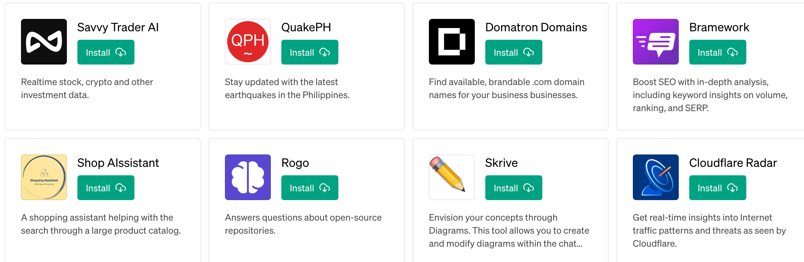
### Savvy Trader AI
株式、暗号、その他の投資データをリアルタイムで提供します。
### QuakePH
フィリピンで発生した最新の地震情報をお届けします。
### Domatron Domains
あなたのビジネスのために、利用可能でブランド力のある.comドメイン名を見つけることができます。
### Bramework
キーワードのボリューム、ランキング、SERPなど、詳細な分析でSEOを強化します。
### Shop AIssistant
大規模な製品カタログの検索を支援するショッピングアシスタントです。
### Rogo
オープンソースリポジトリに関する質問に答えます。
### Skrive
ダイアグラムを通して、あなたのコンセプトを思い描く。このツールは、チャットインターフェイス内でダイアグラムを作成・修正することができます。
### Cloudflare Radar
Cloudflareが見たインターネットのトラフィックパターンや脅威をリアルタイムで把握することができます。
## 36
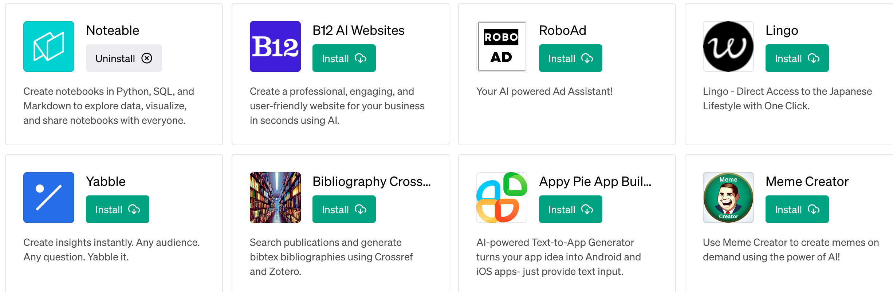
### Noteable
Python、SQL、Markdownでノートブックを作成し、データの探索、視覚化、そしてノートブックをみんなで共有できます。
### B12 AI Websites
AIを使って、プロフェッショナルで魅力的、かつユーザーフレンドリーなビジネスのためのウェブサイトを数秒で作成します。
### RoboAd
AIを搭載した広告アシスタントです！
### Lingo
Lingo - ワンクリックで日本のライフスタイルに直接アクセスできます。
### Yabble
インサイトを即座に作成。どんなオーディエンスにも どんな質問でも。Yabbleはそれを実現します。
### Bibliography Crossref
Crossref と Zotero を使用して、出版物を検索し、bibtex 書誌を生成します。
### Appy Pie App Builder
AIを搭載したText-to-App Generatorは、あなたのアプリのアイデアをAndroidやiOSのアプリに変えます-テキスト入力をするだけです。
### Meme Creator
Meme Creator を使って、AIの力を使ってオンデマンドでミームを作成します！
## 37
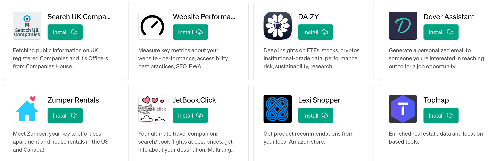
### Search UK Companies
英国で登録された会社およびその役員に関する公開情報をCompanies Houseから取得します。
###  Website Performance
パフォーマンス、アクセシビリティ、ベストプラクティス、SEO、PWAなど、ウェブサイトに関する主要な指標を測定します。
### DAIZY
ETF、株式、暗号に関する深い洞察。パフォーマンス、リスク、持続可能性、リサーチなど、機関投資家レベルのデータ。
### Dover Assistant
求人の連絡を取りたい相手に、パーソナライズされたメールを生成します。
### Zumper Rentals
アメリカやカナダのアパートや家を簡単に借りることができるZumperをご紹介します！
### JetBook.Click
あなたの究極の旅の友：ベストプライスでフライトを検索/予約し、目的地に関する情報を得る。多言語に対応しています。
### Lexi Shopper
お近くのAmazonストアからお勧めの商品を入手できます。
### TopHap
充実した不動産データとロケーションベースのツール。
## 38
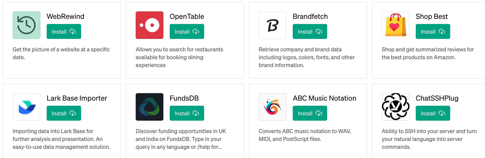
### WebRewind
特定の日付のウェブサイトの画像を取得する。
### OpenTable
食事体験の予約可能なレストランを検索できるようにする。
### Brandfetch
s、色、フォント、その他のブランド情報を取得します。
### Shop Best
アマゾンのベスト商品のショッピングと要約されたレビューを得ることができます。
### Lark Base Importer
データをLark Baseにインポートして、さらなる分析やプレゼンテーションを行う。使いやすいデータ管理ソリューションです。
### FundsDB
FundsDBでイギリスとインドの資金調達の機会を発見してください。問い合わせを任意の言語で入力するか、/helpでサポートします。
### ABC Music Notation
ABC の楽譜を WAV、MIDI、PostScript ファイルに変換します。
### ChatSSHPlug
サーバーに SSH して、あなたの自然言語をサーバーコマンドに変える機能。
## 39
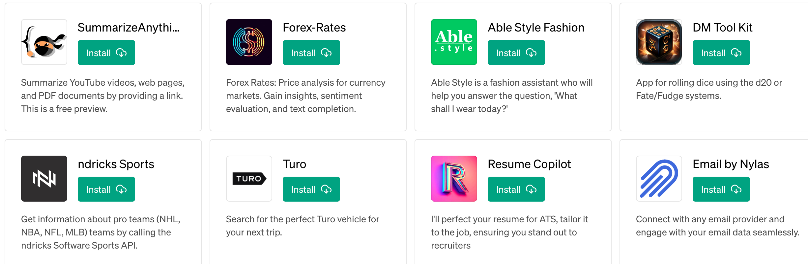
### SummarizeAnything.ai
リンクを提供することで、YouTubeのビデオ、Webページ、PDFドキュメントを要約する。これは無料のプレビューです。
### Forex-Rates
Forex Rates（フォレックス・レート）： 通貨市場の価格分析。洞察を得る、センチメント評価、テキスト補完。
### Able Style Fashion
Able Styleは、「今日は何を着ようかな」という質問に答えてくれる、ファッションアシスタントです。
### DM Tool Kit
d20やFate/Fudgeのシステムを使ってサイコロを振るためのアプリです。
### ndricks Sports
ndricks Software Sports APIを呼び出して、プロチーム（NHL、NBA、NFL、MLB）のチーム情報を取得します。
### Turo
次の旅行に最適なTuro車両を検索できます。
### Resume Copilot
ATS用の履歴書を完璧に仕上げ、仕事に合わせた内容にし、採用担当者にアピールできるようにします。
### Email by Nylas
あらゆるメールプロバイダと接続し、メールデータをシームレスに活用できます。
## 40
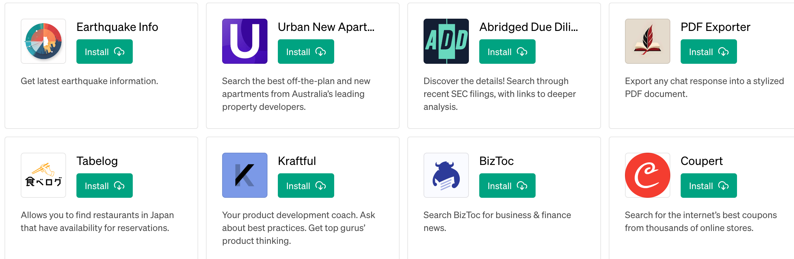
### Earthquake Info
最新の地震情報を入手することができます。
### Urban New Apartments
オーストラリアの大手不動産デベロッパーが提供する、最高のオフ・ザ・プランと新築アパートを検索できます。
### Abridged Due Diligence
詳細を知ることができます！最近のSEC提出書類を検索し、より深い分析へのリンクもあります。
### PDF Exporter
任意のチャット応答を様式化された PDF ドキュメントにエクスポートします。
### Tabelog
日本国内の予約可能なレストランを検索することができます。
### Kraftful
あなたの製品開発コーチです。ベストプラクティスについて質問することができます。一流の人たちの商品思考を知ることができます。
### BizToc
ビジネス＆ファイナンスのニュースをBizTocで検索してみましょう。
### Coupert
何千ものオンラインストアから、インターネット最高のクーポンを検索することができます。
## 41
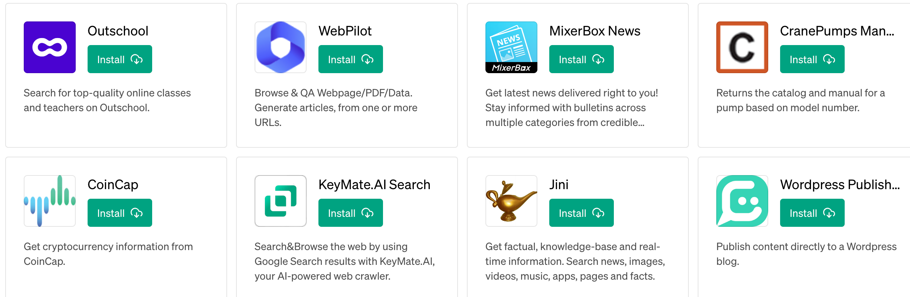
### Outschool
Outschoolで最高品質のオンラインクラスと講師を検索できます。
### WebPilot
ウェブページ/PDF/データの閲覧・QA。1つまたは複数のURLから、記事を生成することができます。
### MixerBox News
最新のニュースをあなたにお届けします！信頼できるソースからの複数のカテゴリーにわたる速報で、常に情報を得ることができます。
### CranePumps Manuals
型番からポンプのカタログとマニュアルを返します。
### CoinCap
CoinCapから暗号通貨情報を入手できます。
### KeyMate.AI Search
AI搭載のウェブクローラーであるKeyMate.AIで、Googleの検索結果を利用してウェブを検索&閲覧する。
### Jini
事実に基づいた、知識ベースの、リアルタイムの情報を得ることができます。ニュース、画像、ビデオ、音楽、アプリ、ページ、事実を検索します。
### Wordpress Publisher
Wordpress ブログに直接コンテンツを公開します。
## 42
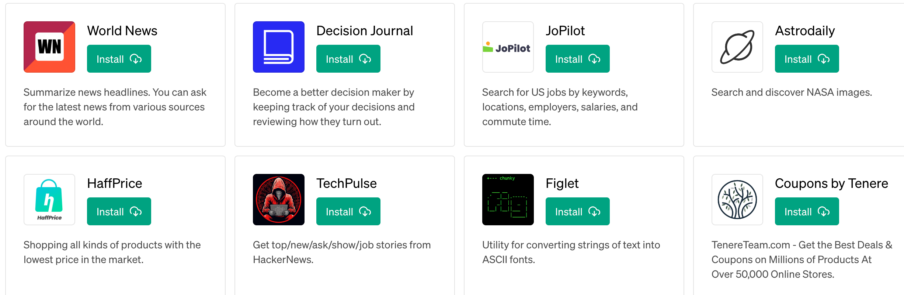
### World News
ニュースのヘッドラインを要約する。世界中の様々なソースから最新のニュースを聞くことができます。
### Decision Journal
自分の決断を記録し、その結果を見直すことで、より良い意思決定者になることができます。
### JoPilot
キーワード、場所、雇用主、給与、通勤時間からアメリカの仕事を検索できます。
### Astrodaily
NASAの画像を検索して発見することができます。
### HaffPrice
あらゆる商品を市場最安値でお買い物。
### TechPulse
HackerNewsのトップ/ニュー/アスク/ショー/ジョブストーリーを入手することができます。
### Figlet
文字列をASCIIフォントに変換するユーティリティです。
### Coupons by Tenere
TenereTeam.com - 50,000以上のオンラインストアで、何百万もの製品のベストディール＆クーポンを入手することができます。
## 43
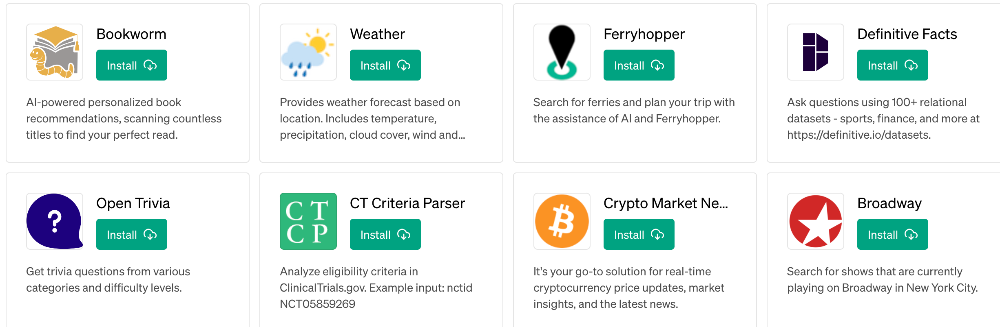
### Bookworm
AIを搭載したパーソナライズされたおすすめ本。無数のタイトルをスキャンして、あなたにぴったりの一冊を見つけます。
### Weather
位置情報に基づいた天気予報を提供します。気温、降水量、雲量、風など、さまざまな情報が含まれています。
### Ferryhopper
AIとFerryhopperの支援により、フェリーを検索し、旅行を計画することができます。
### Definitive Facts
スポーツ、金融など、100以上のリレーショナルデータセットを使って、https://definitive.io/datasets、質問してみましょう。
### Open Trivia
様々なカテゴリや難易度からトリビア問題を入手できます。
### CT Criteria Parser
ClinicalTrials.govの適格基準を解析する。入力例：nctid NCT05859269
### Crypto Market News
リアルタイムの暗号通貨価格の更新、市場の洞察、最新ニュースのためのあなたのゴーイング・ソリューションです。
### Broadway
ニューヨークのブロードウェイで現在上演されているショーを検索できます。
## 44
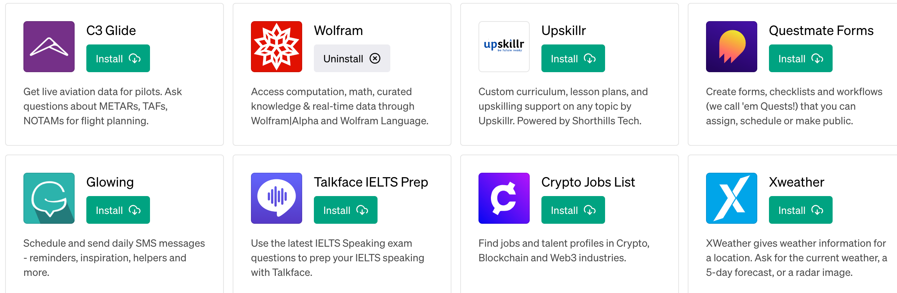
### C3 Glide
パイロットのためのライブ航空データを入手できます。METAR、TAF、NOTAMについて質問し、フライトプランを立てることができます。
### Wolfram
Wolfram|AlphaとWolfram言語を通して，計算，数学，蓄積された知識，リアルタイムのデータにアクセスすることができます．
### Upskillr
Upskillrによるカスタムカリキュラム，レッスンプラン，あらゆるトピックに関するスキルアップのサポート。 Powered by Shorthills Tech.
### Questmate Forms
フォーム，チェックリスト，ワークフロー（私たちはこれを「クエスト」と呼んでいます！）を作成し，割り当てたり，スケジュールしたり，公開したりすることができます．
### Glowing
リマインダー、インスピレーション、ヘルパーなど、毎日のSMSメッセージをスケジュールして送信できます。
### Talkface IELTS Prep
最新のIELTSスピーキング試験問題を使って、TalkfaceでIELTSスピーキングを予習しましょう。
### Crypto Jobs List
Crypto、Blockchain、Web3業界の求人と人材プロフィールを検索できます。
### Xweather
XWeatherは、ある場所の天気情報を提供します。現在の天気、5日間の予報、またはレーダー画像を要求することができます。
## 45
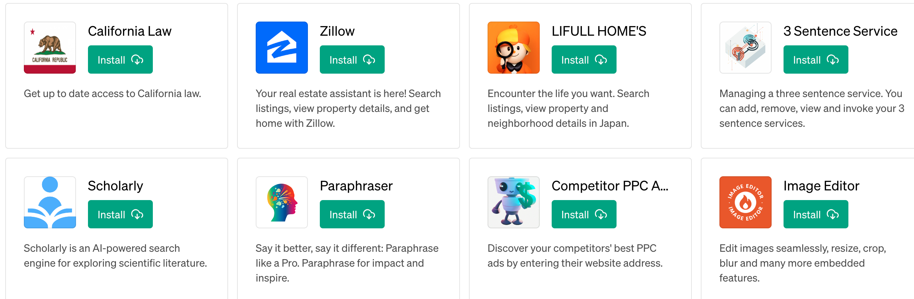
### California Law
カリフォルニア州の法律に関する最新情報を入手できます。
### Zillow
あなたの不動産アシスタントがここにいます！Zillowで物件を検索し、物件の詳細を確認し、家を手に入れましょう。
### LIFULL HOME'S
あなたが望む暮らしに出会える。物件検索、物件詳細の閲覧、近隣情報の閲覧は日本で。
### 3 Sentence Service
3文サービスを管理する。3文サービスの追加、削除、閲覧、呼び出しを行うことができます。
### Scholarly
Scholarlyは、科学文献を探索するためのAI搭載の検索エンジンです。
### Paraphraser
よりよく言い、より違うことを言う： プロのような言い換えを。インパクトのある言い換えを行い、インスピレーションを与えます。
### Competitor PPC Ads
競合他社のウェブサイトアドレスを入力すると、競合他社のベストPPC広告を発見することができます。
### Image Editor
画像をシームレスに編集し、サイズ変更、切り取り、ぼかし、その他多くの埋め込み機能を使用できます。
## 46
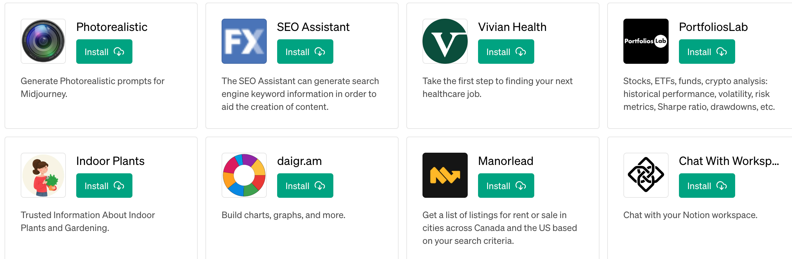
### Photorealistic
MidjourneyのPhotorealisticプロンプトを生成します。
### SEO Assistant
SEO Assistant は、コンテンツの作成を支援するために、検索エンジンのキーワード情報を生成することができます。
### Vivian Health
次のヘルスケアの仕事を見つけるための最初のステップを踏み出しましょう。
### PortfoliosLab
株式、ETF、ファンド、暗号の分析：過去のパフォーマンス、ボラティリティ、リスク指標、シャープレシオ、ドローダウンなど。
### Indoor Plants
室内植物とガーデニングに関する信頼できる情報です。
### daigr.am
チャート、グラフなどを構築します。
### Manorlead
カナダとアメリカの各都市で、検索条件に基づいた賃貸・売買物件のリストを入手できます。
### Chat With Workspace
Notionのワークスペースとチャットできます。
## 47
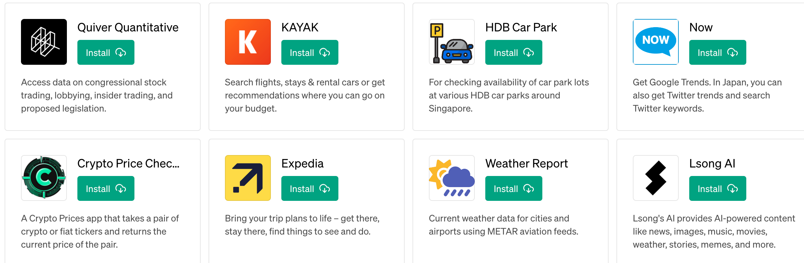
### Quiver Quantitative
議会の株式取引、ロビー活動、インサイダー取引、法案に関するデータにアクセスできます。
### KAYAK
航空券、宿泊、レンタカーを検索したり、予算内で行けるおすすめの場所を教えてもらったりできます。
### HDB Car Park
シンガポール各地のHDBカーパークの駐車場の空き状況を確認することができます。
### Now
Google Trendsを取得できます。日本では、Twitterのトレンドを取得したり、Twitterのキーワードを検索したりすることもできます。
### Crypto Price Checker
暗号またはフィアットのティッカーのペアを取得し、そのペアの現在の価格を返すCrypto Pricesアプリです。
### Expedia
旅行プランに命を吹き込む - 現地への移動、滞在、見どころの検索が可能です。
### Weather Report
METAR 航空フィードを使用して、都市と空港の現在の気象データを提供します。
### Lsong AI
LsongのAIは、ニュース、画像、音楽、映画、天気、ストーリー、ミームなど、AIを活用したコンテンツを提供します。
## 48
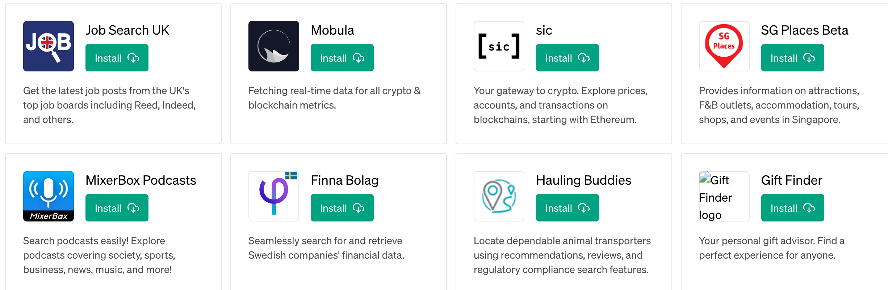
### Job Search UK
Reed、Indeedなど、英国のトップ求人サイトから最新の求人情報を入手できます。
### Mobula
すべての暗号＆ブロックチェーンメトリクスのリアルタイムデータを取得します。
### sic
暗号へのあなたのゲートウェイ。イーサリアムをはじめとするブロックチェーン上の価格、アカウント、トランザクションを調べることができます。
### SG Places Beta
シンガポールの観光スポット、飲食店、宿泊施設、ツアー、ショップ、イベントなどの情報を提供します。
### MixerBox Podcasts
ポッドキャストを簡単に検索できます！社会、スポーツ、ビジネス、ニュース、音楽などをカバーするポッドキャストを検索できます！
### Finna Bolag
スウェーデン企業の財務データをシームレスに検索・取得できます。
### Hauling Buddies
推奨、レビュー、規制遵守の検索機能を使用して、信頼できる動物輸送業者を見つけることができます。
### Gift Finder
あなただけのギフトアドバイザー。誰にでもぴったりの体験が見つかります。
## 49
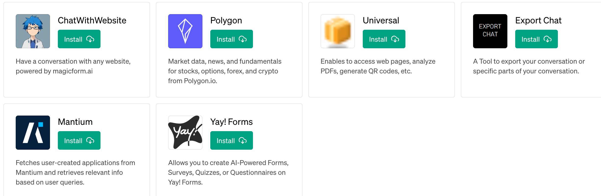
### ChatWithWebsite
magicform.aiが提供する、あらゆるウェブサイトと会話をすることができます。
### Polygon
Polygon.ioの株式、オプション、FX、暗号のマーケットデータ、ニュース、ファンダメンタルズです。
### Universal
ウェブページへのアクセス、PDFの解析、QRコードの生成などを可能にします。
### Export Chat
会話や会話の特定の部分をエクスポートするためのツールです。
### Mantium
Mantiumからユーザーが作成したアプリケーションをフェッチし、ユーザーのクエリに基づいて関連情報を取得します。
### Yay! Forms
Yay.FormsでAIを搭載したフォーム、調査、クイズ、アンケートを作成できるようにします！FormsでAIを搭載したフォーム、アンケート、クイズ、アンケートを作成できます。